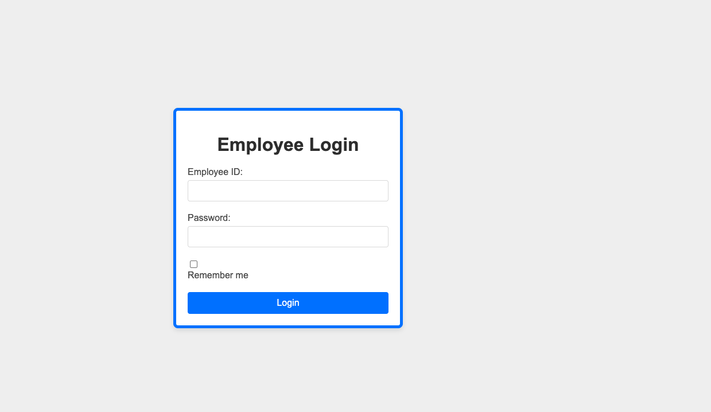
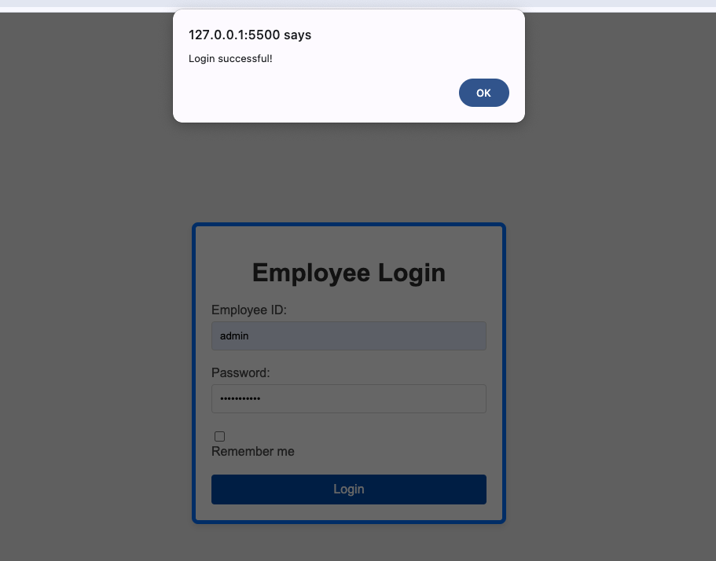
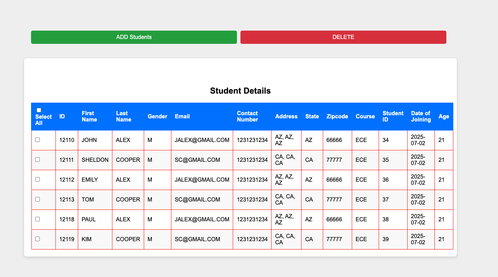
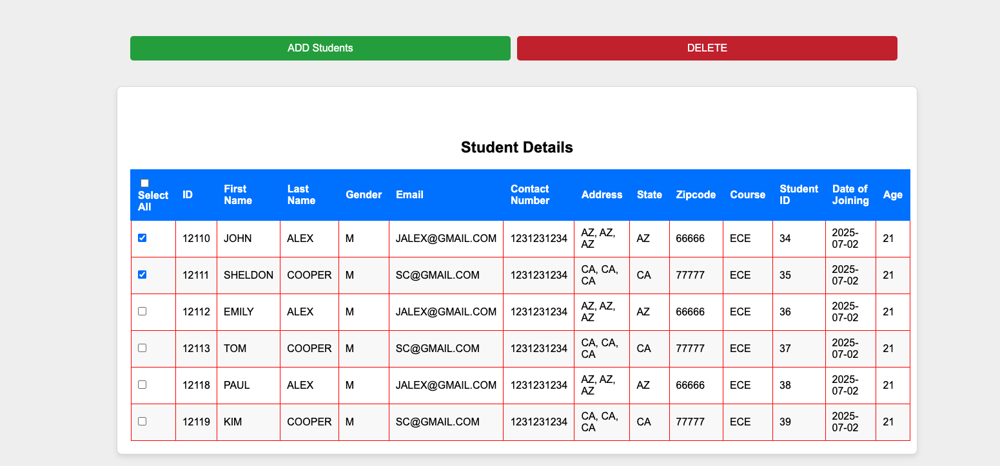
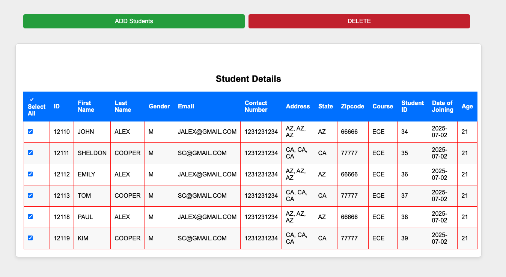
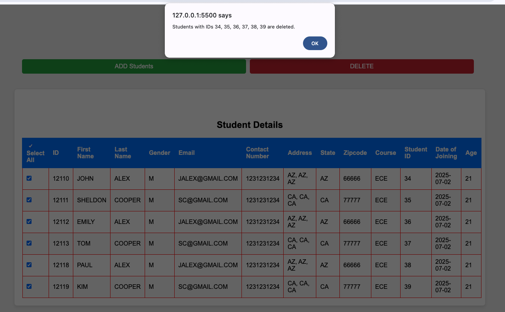

# mis-frontend

This repository contains the frontend for the Management Information Systems (MIS) project. The frontend is developed using HTML, CSS, JavaScript and jQuery to provide a user interface that integrates seamlessly with the REST APIs developed in the backend project, ManagementInformationSystems, which is built using Java and Spring Boot.

### Employee Login Screen

### Login Succesful Screen

### Display Records

### Select a Record

### Select All Screen

### Delete Records Screen

